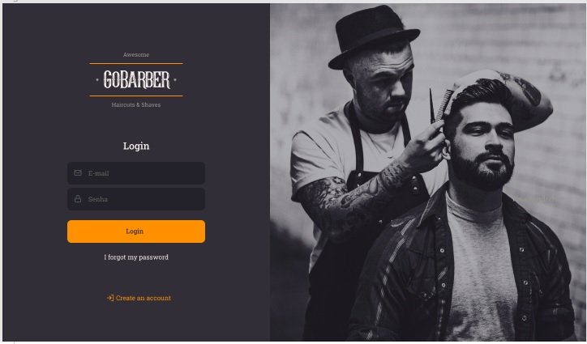
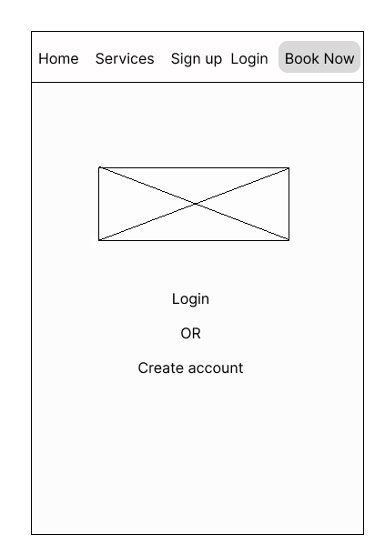
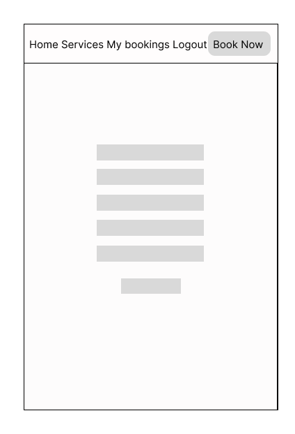
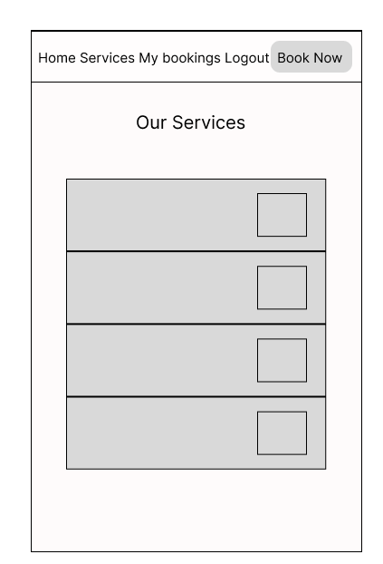
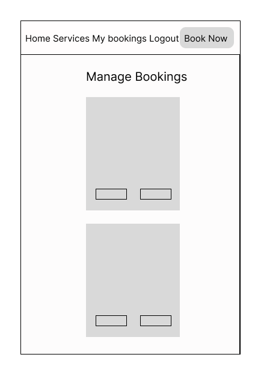
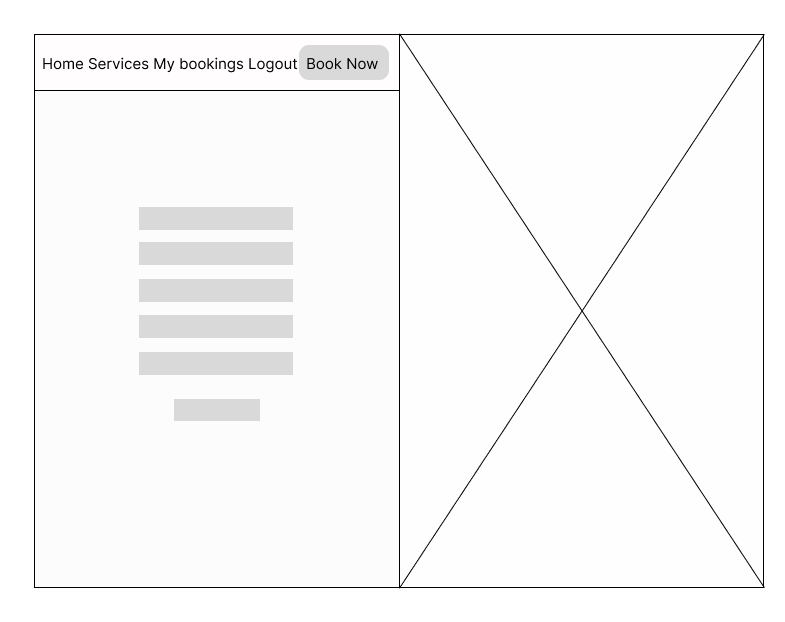
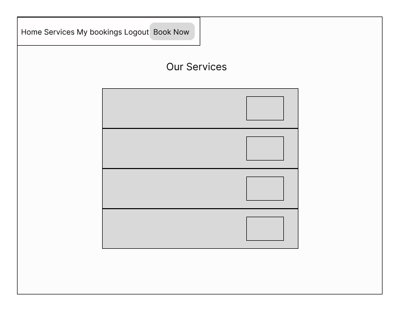
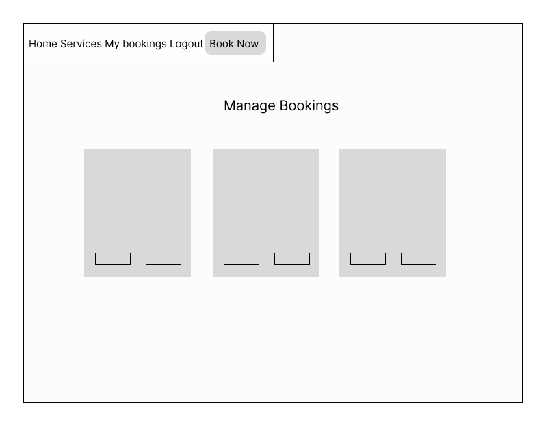

- [**UX (User Experience)**](#ux-user-experience)
  - [**User Stories**](#user-stories)
- [**Design and Site Structure**](#design-structure)
  - [**Functional Structure**](#functional-structure)
  - [**Wireframes**](#wireframes)
- [**Features**](#features)
  - [**Site Navigation**](#site-navigation)
  - [**Responsive Design**](#responsive-design)
- [**Technologies**](#technologies)
  - [**Languages**](#languages)
  - [**Frameworks and Libraries**](#frameworks)
  - [**Tools**](#tools)
- [**Testing**](#testing)
- [**Deployment**](#deployment)
- [**Credits**](#credits)
  - [**Code**](#code)
  - [**Content**](#content)
  - [**Media**](#media)
  - [**Inspiration**](#inspiration)
  - [**Acknowledgements**](#acknowledgements)

  
# Portfolio Project 4 - Barbershop Gobarber reservation system  

## Project goals
This is the fourth project under the Code Institute Diploma in Software Development (E-commerce Applications) program.
This website is a fictional barbershop called GOBARBER. It is designed to be responsive and accessible on a variety of devices for the ease of use of the site by potential users.

## UX (User Experience)

### User stories

#### First time visitor goals

As a first time visitor, I want:
* to easily understand the main purpose of the site,
* to be able to easily navigate throughout the site,
* to be able to register a user account to access all content without restrictions,
* to be able to reserve a day and time for a service, view booking details and make changes to created bookings and delete my bookings,
* to be able to log out of my user account.
       
        
#### Returning and frequent user goals

As a returning user, I want:
* to sign in to my user account,
* to make a service booking, 
* to view my booking details, 
* to edit mt booking details or delete them.
* to sign out of my account to keep my account safe.

#### Site Administrator goals
As a Site Administrator I would like to be able to create, view, edit and delete bookings data.    

[Back to the top](#table-of-contents)

## Design and Site structure

The site was based on the Gobarber template from the Figma Community site. The look of the site, color scheme, font, logo and image for the home page were borrowed from the template.
The main layout page can be seen below:

Gobarber website design template 

 

### Functional Structure

**Home page:** The home page contains a menu, logo and an image that gives the user an idea of ​​the type of service provided. Under the logo in the center are links to register a new user or login for an existing user.
Registration and login are also available from the navigation bar.

**Registration page:** The user must create an account to make a reservation.
To do this, he is asked to fill out a form on the page with the required fields: username and password. There is also an optional email field.

**Login page:** A username and password are required to log in existing users.
The user can use the navigation menu or the link under the logo on the home page.
After a successful login, the user receives a message at the top of the screen and  is redirected to the page with their reservations. If the user has no bookings, then he see a message about the absence of orders and an offer to make a reservation.

**Logout page:** Logging out of the account is done through the menu, after which the user is redirected to the logout page where he must confirm his desire to log out of the account. After a successful logout, the user is returned to the home page and receives a message at the top of the screen.

**Services page:** The page displays the services provided and barbershop prices.
Clicking on the price of the selected service redirects the authorized user to the service booking page. An unauthorized user is prompted to register or log into an account before making a booking.

**Booknow page:** The Booknow page is only available to authenticated users.
The user is asked to fill out a form with the required fields - name, phone, service, time and date, and an optional field - email.
After filling out the form, the user is redirected to the page of current bookings.

**Booking page:** Only authenticated user ahave access to Booking page. The link to this page becomes visible in the navigation menu once a user is authenticated. Booking page shows to user information about made bookings and contain  Change button and Delete button for manage booking.

**Change booking page:** This page is available only to authenticated users and has the same functionality and form as the Booknow page, where user can change  booking details.

**Delete booking page:** This page is only available to authenticated users and has the same functionality and form as the Booknow page, where the user can change the booking details. The user has the ability to delete his order by selecting the Delete button on the Booking page. After that, he will be redirected to the delete page where he needs to confirm his intention. After successfully deleting the booking, he will return to the Booking page and and receives a message at the top of the screen.
Also, if the user changes his mind, he can return to the page by clicking on the Back to my Bookings button.

[Back to the top](#table-of-contents)

### Wireframes

The wireframes were slightly modified during the actual creation of the project, e.g. with pages installed removed form for user convenience and better UX.
The wireframes can be seen below:

**For Mobile view and small screens**

Home page

Sign up page

Services page

Bookings page

 

**For Desktop view**

Home page

Sign up page

Services page

Bookings page

 

[Back to the top](#table-of-contents)